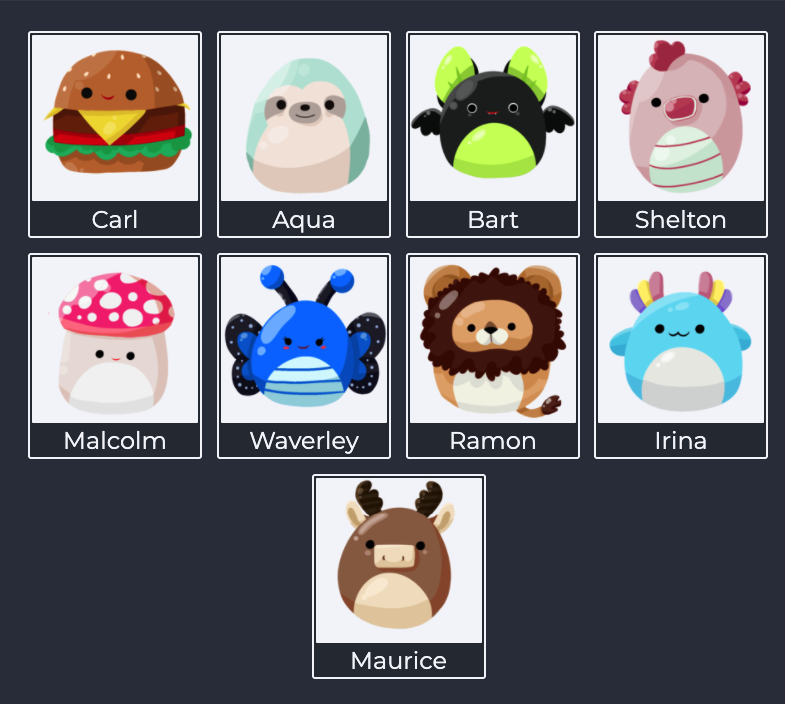

# Memory card game
Memory card game created with React for The Odin Project.

## Demo
Here is a working live demo: https://kapaha.github.io/memory-card-game/

## Installation & running
```bash
git clone git@github.com:kapaha/memory-card-game.git
cd memory-card-game
npm install
npm run start
```

## General info
This project was created as a part of the [Javascript](https://www.theodinproject.com/paths/full-stack-javascript/courses/javascript/lessons/memory-card) course with [The Odin Project](https://theodinproject.com). The aim of this project was to solidate the knowledge I have learnt about React Hooks.

## Features
* Game instructions
* Score system
* Level system
* Card shuffling
* Card animations

## Built with
* React
* CSS Modules

## Status
The project is finished, however I may continue to improve on it as my knowledge of web development improves.